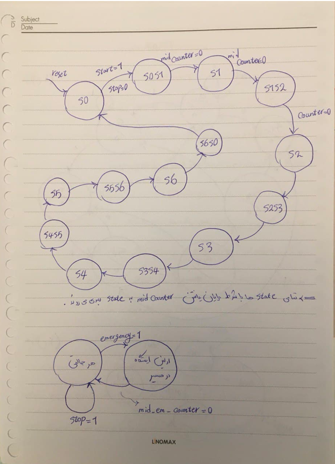

# :metro: Underground Autonomous Vehicle

This repository contains a VHDL-based simulation of a control system for an autonomous vehicle operating in an underground station. The system controls the vehicle's movements based on input signals received from the environment. The vehicle starts stationary with its doors closed. It stops at each station for a specific duration before resuming its journey. The vehicle can also handle emergency stops, priority-based signals, and speed control using a pseudo-random LFSR.

Initially, the car’s door is open, and it waits at the zero station. It then receives a list of destination stations and their corresponding stop times as input. Each station and stop time is represented by four bits. Upon pressing the start button, the car’s door closes, and it proceeds to the specified stations, stopping at each for the designated time. After completing a stop, the door closes, and the car moves to the next station.

If the emergency button is pressed while the car is in motion, it must stop at the next station, remain there for 10 seconds, and then resume its journey according to the provided list. If the car encounters an unexpected obstacle, it must halt all operations immediately. It waits until the obstacle is removed before resuming its journey.

When the chance input is activated, a four-bit random number is generated, and the car is directed to the corresponding station. Once the car completes the list of tasks, it returns to the zero station and waits for a new operation.

## Key Points

* The distance between each station and its adjacent station is $5$ km.
* The car's velocity is provided as input by the user. For example, if the car's velocity is $3$ km/s, traveling from station $12$ to station $7$ requires covering a total distance of $25$ km, which would take approximately $8$ seconds.
* Each second corresponds to ten clock signals for the system's operation.

## Getting Started

### Prerequisites

* **VHDL Compiler**
* **Simulation Software** (ActiveHDL is recommended)

### Steps to Run

1. **Clone the repository:** <br />
```
git clone https://github.com/sinaabbasi1/underground-autonomous-vehicle-VHDL.git
```
2. **Compile and simulate:** Load the project in your preferred VHDL simulation software. Then, compile the project, configure the inputs, and run the simulation to observe the outputs.

## Inputs of the Autonomous Vehicle System
* `clk` → Clock
* `reset` → Return to the initial state and wait for the `start` input.
* `start` → Initiates the car's journey.
* `speed` → Sets the car's constant velocity.
* `stations` → A string of stations and stops at each station (at least four bits for each and with a minimum of six stations). \
  Example: ${\color{pink}x_1x_1x_1x_1t_1t_1t_1t_1}$ _ ${\color{lightgreen}x_2x_2x_2x_2t_2t_2t_2t_2}$ _ ${\color{yellow}x_3
x_3x_3x_3t_3t_3t_3t_3}$ _ ${\color{violet}x_4x_4x_4x_4t_4t_4t_4t_4}$ _ ${\color{cyan}x_5x_5x_5x_5t_5t_5t_5t_5}$ _ ${\color{orange}x_6x_6x_6x_6t_6t_6t_6t_6}$
* `stop` → This input indicates that an unexpected obstacle has appeared in the car's path. As a result, the car must halt all operations until this input is reset to zero.
* `emergency` → If activated, the car stops at the nearest station and continues its path after 10 seconds.
* `chance` → Upon activation of this input, a four-bit random number is generated. The car will then proceed to the specified station after the current destination, stop there for 5 seconds, and then continue its journey based on the remaining list of destinations.

**Note:** The priority of the `stop` input is higher than the `emergency` input, and the priority of the `emergency` input is higher than the `chance` input.

## Desired Outputs

* `moving` → Display whether the vehicle is moving or stopped, and whether the door is open or closed.
* `station_num` → Show the current station number when stopped, and the destination station number when moving.
* `station_halt` → Reveal the remaining time at the station. When moving, display zero.
* `nextstation_left` → Show the remaining time to the next station (as an integer number). When stopped, display zero.
  For example, if the vehicle velocity is $2$ km/s and the distance to the next station is $13$ kilometers, the remaining time to the station will be:
  
$$\text{Time to Next Station} = \frac{\text{Distance to Next Station}}{\text{Car Velocity}} = \frac{13 \text{ km}}{2 \text{ km/s}} = 6 \text{ seconds}$$

* `time_left` → Demonstrate the total remaining time to complete the operation. (as an integer number)

$$ \text{Total Remaining Time} = \frac{\text{Total Remaining Kilometers}}{\text{Constant Car Velocity}} + \text{Total Remaining Stop Times} $$

For example, if the total remaining distance is 212 kilometers, the car velocity is 2 kilometers per second, and the total remaining stop time is 95 seconds, the remaining time will be:

$$ \frac{212 \text{ km}}{2 \text{ km/s}} + 95 \text{ s} = 201 \text{ seconds} $$
 
* `total_time` → Display the total time elapsed since the start.

## Screenshots

|  | 
|:--:| 
| *The full waveform viewer (duration: 0 µs to 1680 µs).* |

|  | 
|:--:| 
| *Waveform viewer zoomed in (duration: 0 µs to 850 µs).* |

|  | 
|:--:| 
| *Waveform viewer zoomed in (duration: 850 µs to 1680 µs).* |

|  | 
|:--:| 
| *FSM* |

## Contributing

Feel free to submit issues or pull requests if you find bugs or want to improve this project.

## License

This project is open-source and available under the [MIT License](LICENSE).
